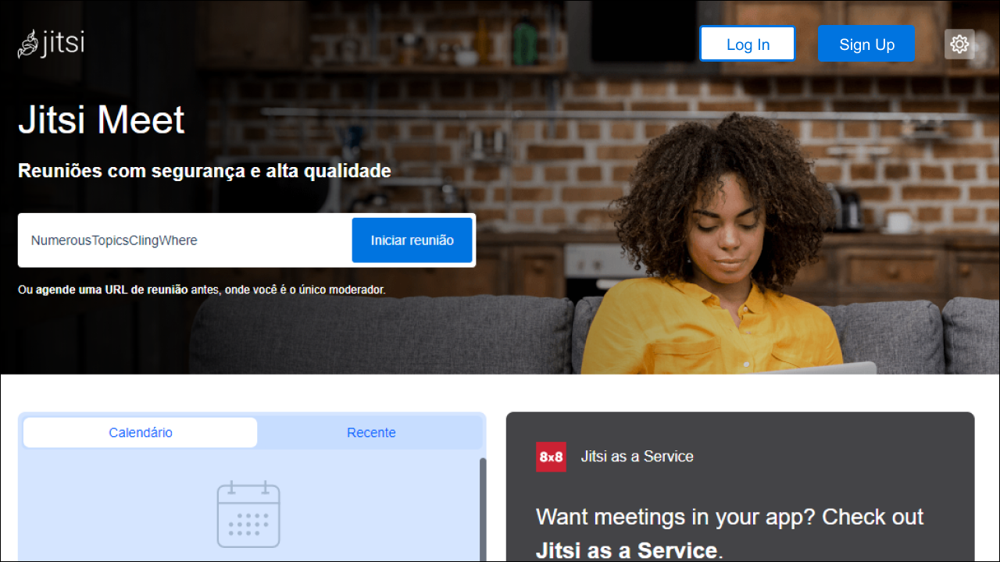
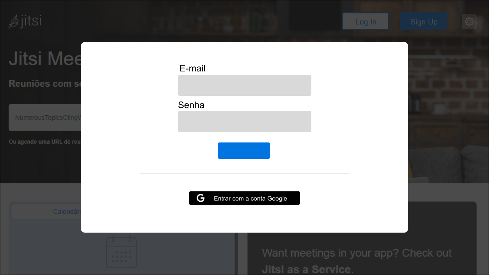
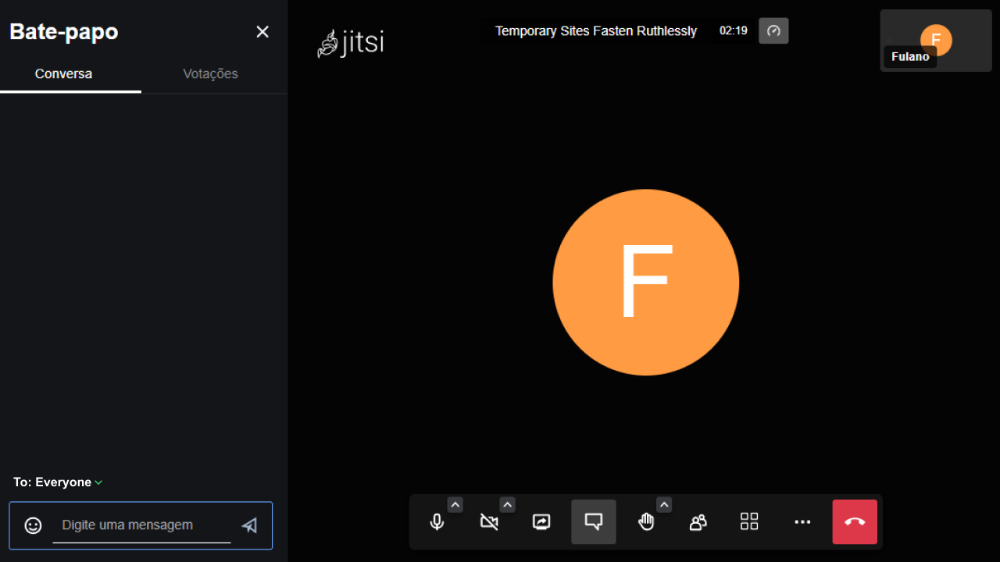
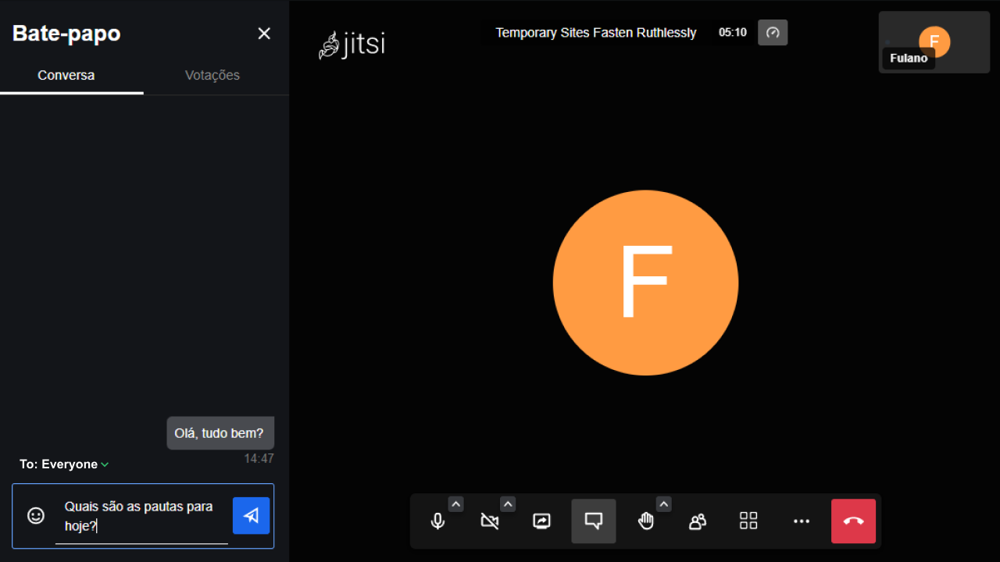
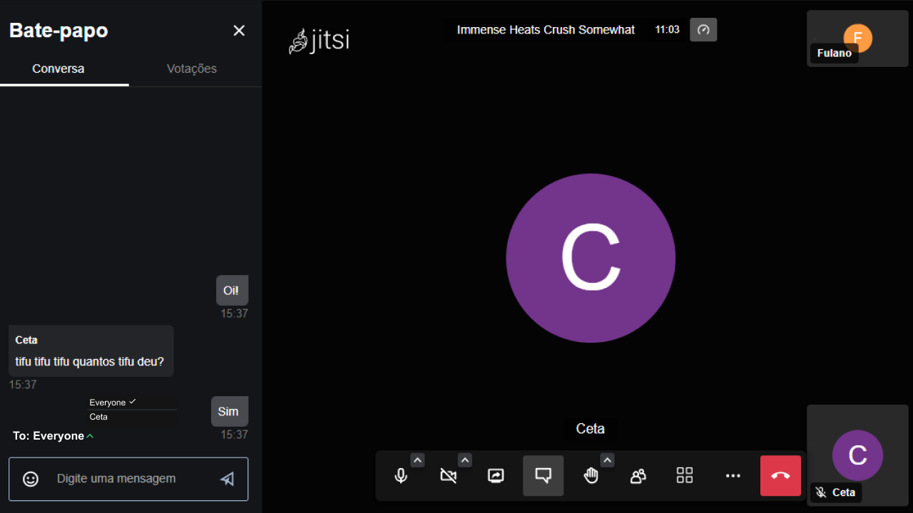
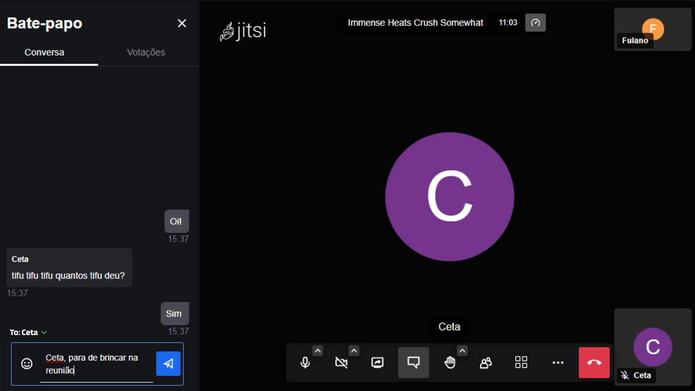
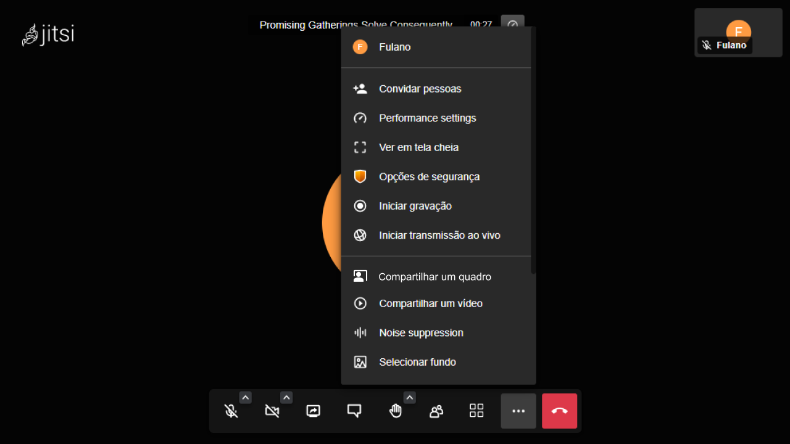
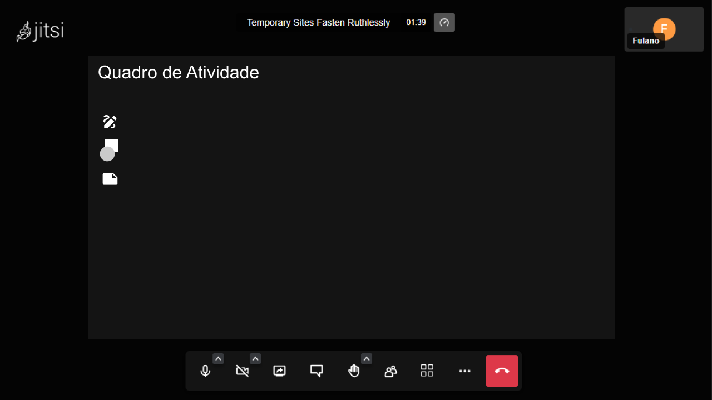

# Protótipo

## Versionamento

| Versão |    Data    | Descrição                                             | Autor           |
| ------ | :--------: | ----------------------------------------------------- | --------------- |
| 1.0    | 15/08/2022 | Iniciando elaboração do protótipo                     | Samuel Avila    |
| 1.1    | 17/08/2022 | Elaboração da documentação e finalização do protótipo | Samuel Avila    |
| 1.2    | 17/08/2022 | Revisão do protótipo e documentação                   | Gabriel Sabanai |
| 1.3    | 17/08/2022 | Revisão: Pequenos Erros de Escrita                    | Gabriel Mariano |

_Tabela 1: Versionamento_

## Introdução

Ao longo do projeto, elicitamos alguns requisitos que ainda não foram implementados pelo Jitsi, assim, apresentaremos uma proposta de implementação através do protótipo, possibilitando a validação desses novos requisitos.

## Metodologia

A origem do protótipo vem dos [Requisitos Funcionais](https://requisitos-de-software.github.io/2022.1-Jitsi-Meet/elicitacao/requisitoselicitados/), especificamente os **RF28**, **RF29**, **RF30** e **RF31**.

## Resultado: Protótipo

### RF30: Realizar login

Na tela inicial, adicionamos dois botões, onde o usuário pode se cadastrar com o e-mail ou, casa já tenha um cadastro, ele pode realizar o login. Mesmo com essa opção sendo implementada, não seria obrigatório realizar o login ou cadastro, permitindo que os usuários que desejarem possam continuar usando o Jitsi da mesma forma anterior à implementação.

_Figura 1: Primeira tela do fluxo demonstrativo do RF30_

_Figura 2: Segunda tela do fluxo demonstrativo do RF30_

### RF31: Conexão com outros usuários

Após realizar o login, o usuário pode visualizar suas conexões no canto inferior direito.

_Figura 3: Tela do fluxo demonstrativo do RF31_

### RF28: Mensagens privativas na reunião

Ao entrar em uma reunião e abrir o chat, adicionamos um indicador logo acima de onde o usuário escreve a mensagem, para que o usuário posso escolher quem poderá visualizar a mensagem enviada, se será só uma pessoa ou se todos presentes.

_Figura 4: Primeira tela do fluxo demonstrativo do RF28_

_Figura 5: Segunda tela do fluxo demonstrativo do RF28_

_Figura 6: Terceira tela do fluxo demonstrativo do RF28_

_Figura 7: Quarta tela do fluxo demonstrativo do RF28_

### RF29: Compartilhar quadro durante a reunião

Juntamente às opções adicionais do Jitsi, prototipamos a adição da opção de compartilhar um quadro para que todos na reunião possam visualizar e editar um conteúdo simultaneamente.

_Figura 8: Primeira tela do fluxo demonstrativo do RF29_

_Figura 9: Segunda tela do fluxo demonstrativo do RF29_

## Referências

[Documento de Validação do grupo Tembici](https://requisitos-de-software.github.io/2021.2-Tembici/analise/validacao/prototipo/)

SERRANO, Maurício; SERRANO, Milene; Requisitos Acesso em: 23 de Março de 2022.
