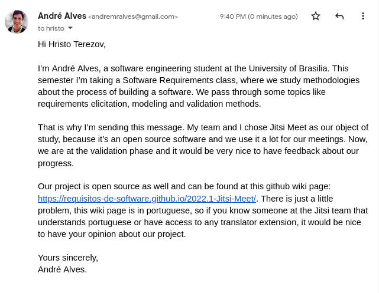

# Validação Informal

## Versionamento
 
| Versão | Data | Modificação | Autor |
|-|-|:-:|:-:|
| 1.0 | 17/08/2022 | Criação do Documento | André Alves |
| 1.1 | 17/08/2022 | Adição do email enviado | André Alves |
| 1.2 | 17/08/2022 | Revisão do artefato | Felipe Moura|

*Tabela 1: versionamento*
 
## Introdução

&emsp;&emsp; Neste artefato, será introduzida a comprovação
informal ou validação informal, uma etapa importante para a confirmação de que
o produto é realmente aquele desejado pelo usuário.

&emsp;&emsp; A validação informal é basicamente uma tarefa
de leitura de descrições em linguagem natural e do uso dos clientes a fim de
encontrar alguma inconsistência entre os requisitos que foram expressados e o
que o usuário realmente deseja que seja entregue. Essa estratégia é comumente
relacionada à falta de uma apoio automatizado e à necessidade de habilidades
analíticas dos leitores.

 
## Metodologia

&emsp;&emsp; Para realizar a validação informal, escolhemos
entrar em contato com a equipe de desenvolvedores, empresa e envolvidos com o
aplicativo do Jitsi Meet através de mensagens via email e algumas redes sociais.

Mensagem por e-mail:

*Imagem 1: Email enviado para desenvolvedores do Jitsi Meet*

*Autor: André Alves*
 
## Respostas

&emsp;&emsp; Ainda não obtivemos nenhuma resposta. Assim que
obtivermos alguma, atualizaremos este documento.

 
## Referências

 SERRANO, Maurício; SERRANO, Milene; Requisitos - Aula 20. Acesso em: 23 de Março de 2022. 

**Tembici**. Disponível em: <https://requisitos-de-software.github.io/2021.2-Tembici/analise/validacao/validacao_informal>. Acesso em 17 agosto de 2022.
