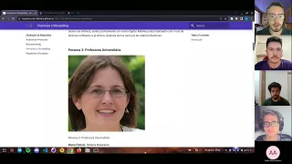

# Início

## Versionamento do projeto

| Versão | Data  |    Modificação    |    Autor     |
| ------ | ----- | :---------------: | :----------: |
| 1.0    | 13/07 | Criação da página | Samuel Avila |

_Tabela 1: Versionamento_

## Introdução

A apresentação do segundo ponto de controle tem como foco a **Elicitação e Priorização de Requisitos**. A seguir será apresentado como se encontra o projeto, expplicitando o que foi feito até agora.

## Apresentação

_Imagem 1: thumbnail do vídeo da segunda apresentação_
