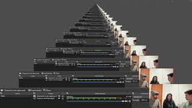

# Análise de Protocolo

## Versionamento

| Versão | Data  |                           Modificação                           |             Autor              |
| ------ | ----- | :-------------------------------------------------------------: | :----------------------------: |
| 1.0    | 05/07 |               Realização da Análise de Protocolo                | Samuel Avila e Gabriel Sabanai |
| 1.1    | 13/07 | Elicitação de Requisitos e Documentação da Análise de Protocolo |          Samuel Avila          |
| 1.2    | 13/07 |                   Documentação da entrevista                    |          Samuel Avila          |

_Tabela 1: Versionamento_

## Introdução

Análise de protocolo é uma das técnicas para elicitar requisitos na qual solicitamos que um usuário execute as principais operações do sistema e verbalize (como se estivesse narrando) tudo que estiver fazendo.

## Metodologia

Para realizar essa técnica, uma usuária voluntária - que nunca havia usado o Jitsi - foi escolhida para seguir algumas instruções e, assim, foi observado como ela interagiu com a plataforma para fazer a elicitação dos requisitos. A dinâmica foi gravada e esse vídeo foi utilizado para fazer a documentação das ações realizadas e dos requisitos elicitados.

| Membros Participantes          | Usuário Analisado  |
| ------------------------------ | ------------------ |
| Gabriel Sabanai e Samuel Avila | Fernanda Gagliardi |

_Tabela 2: Participantes na análise de protocolo._

## Observações

Foi possível observar que o aplicativo é intuitivo para uma pessoa que está relativamente acostumada com outras plataformas de vídeo conferência. Apesar da usuária ter demorado mais do que o esperado para nomear e começar a reunião, ela estava bastante confortável ao explorar todas as funcionalidades dentro da reunião.

## Verbalização do usuário

|                Operação                | Observações                                                                                                                                                                                                                               |
| :------------------------------------: | ----------------------------------------------------------------------------------------------------------------------------------------------------------------------------------------------------------------------------------------- |
|            Acessar o Jitsi             | A plataforma é facilmente acessada pelo navegador                                                                                                                                                                                         |
|            Nomear a reunião            | O Jitsi exige a nomeação da reunião, nesse momento o Jitsi gera um aviso sobre a segurança da reunião                                                                                                                                     |
|           Começar a reunião            | Gera o link da reunião e abre uma tela para fazer algumas ações antes de entrar na reunião, o usuário não precisa se cadastrar ou logar para entrar numa reunião                                                                          |
|        Preparar para a reunião         | Jitsi avisa sobre os status do microfone, pede permissões para utilizar os dispositivos e sugere utilização de extensões e integrações                                                                                                    |
|        Definir nome de usuário         | O usuário define o nome que será exibido aos outros participantes                                                                                                                                                                         |
|     Convidar outros participantes      | O Jitsi oferece a opção de copiar o link para enviar em outro meio de comunicação                                                                                                                                                         |
|     Selecionar background virtual      | O Jitsi permite alterar o background do vídeo, oferece alguams opções de imagem, permite que o usuário faça upload de outras imagens para usar como background e mostra a pre-visualização do background                                  |
|           Entrar na reunião            | O usuário seleciona entrar na reunião, a preparação para a reunião (configurações, compartilhar reunião e estilização) não é obrigatória                                                                                                  |
|    Interagir com outro participante    | O usuário começa a explorar os botões e formas de interação na plataforma                                                                                                                                                                 |
|      Interações de áudio e vídeo       | O usuário explora os status do próprio áudio, observa o vídeo de outro integrante e gosta de como a plataforma da feedbacks de status                                                                                                     |
|           Compartilhar tela            | O usuário tenta compartilhar a tela e o Jitsi emite um alerta de permissão                                                                                                                                                                |
| Mandar e visualizar mensagens de texto | O usuário vê a notificação do chat, visualiza e responde a mensagem                                                                                                                                                                       |
|       Criar e responder enquetes       | O usuário se surpreende com a possibilidade de criar enquetes, faz testes com a funcionalidade e gosta do resultado, ressaltando a facilidade e utilidade da mesma                                                                        |
|          Interagir com emotes          | O usário usa o "levantar a mão" e se alegra muito com a possibilidade de se expressar com emotes e sons                                                                                                                                   |
|             Alterar layout             | O usuário muda a disposição dos vídeos dos participantes, observando que consegue visualizar o próprio vídeo                                                                                                                              |
|         Convidar participantes         | O Jitsi permite visualizar os atuais participantes (assim como os status de vídeo e áudio dos mesmos) e convidar pessoas durante a reunião                                                                                                |
|          Criar breakout rooms          | O usuário cria salas separadas dentro da reunião e consegue movimentar os participantes entre elas                                                                                                                                        |
|       Gerenciar áudios e vídeos        | O usuário (moderador) consegue enviar uma notificação aos outros participantes pedindo para que abram o microfone e consegue fechar o microfone e vídeo de todos ou desabilitar áudio e vídeo de todos exceto um participante selecionado |
|           Configurar reunião           | O Jitsi permite que o moderador configure a reunião (sons de reação, visualização dos vídeos, status do microfone e vídeo)                                                                                                                |
|           Configurar perfil            | O Jitsi permite que o usuário altere o nome e associe um email a ele                                                                                                                                                                      |
|        Configurar dispositivos         | O Jitsi permite que o usuário altere as configurações de câmera, microfone e saída de áudio durante a reunião (também permitindo que o usuário faça testes de áudio)                                                                      |
|          Outras configurações          | O Jitsi permite que usuário altere as configurações de integração com calendário, sons e outros, porém o usuário não explorou essas funcionalidades                                                                                       |
|               Mais ações               | O usuário utiliza o botão de "mais ações" e observa as funcionalidades: visualizar em tela cheia, gravar a reunião, compartilhar vídeo e visualizar status dos microfones                                                                 |
|    Visualizar status dos microfones    | O Jitsi permite que o usuário veja quanto tempo de fala cada participante teve na reunião                                                                                                                                                 |
|         Expulsar participantes         | O Jitsi permite que o moderador expulse participantes da reunião                                                                                                                                                                          |
|            Encerrar reunião            | O usuário encerra a reunião e comenta que achou fácil utilizar o Jitsi                                                                                                                                                                    |

_Tabela 3: Documentação da análise de protocolo_

### Vídeo da Análise de Protocolo

_Vídeo 1: thumbnail do vídeo da análise de protocolo_

## Entrevista

Após a análise de protocolo, fizemos algumas perguntas para nosso usuário voluntário, essas perguntas nos ajudaram a chegar a alguns dos requisitos - principalmente os não-funcionais - elicitados

### Perguntas feitas na entrevista

1. Você já utilizou outras plataformas de vídeoconferência?
2. Foi fácil utilizar todas as funcionalidades do Jitsi?
    - Você já havia utilizado o Jitsi antes?
3. O que você mais gostou na plataforma?
    - Algum outro ponto que você gostaria de destacar?
4. Alguma sugestão de melhoria?
    - Teve algo que você não gostou?
    - Mais algum feedback?

### Vídeo da entrevista

_Vídeo 2: thumbnail do vídeo da entrevista_

## Requisitos elicitados

A partir das observações feitas sobre a análise de protocolo, foi possível elicitar alguns requisitos e priorizá-los de acordo com o método MoSCoW.

**Legenda**:

-  RF: Requisito funcional
-  RNF: Requisito não-funcional

|  ID   | Descrição                                                                                                    | Prioridade |
| :---: | ------------------------------------------------------------------------------------------------------------ | :--------: |
| RF01  | O Jitsi permite criação de reuniões                                                                          |    Must    |
| RF02  | O Jitsi permite que o usuário configure o próprio áudio e vídeo                                              |    Must    |
| RF03  | O Jitsi permite integração com calendário                                                                    |   Could    |
| RF04  | O Jitsi permite a visualização do histórico de reuniões                                                      |   Could    |
| RF05  | O Jitsi permite que o usuário se identifique ou fique no anonimato                                           |    Must    |
| RF06  | O Jitsi permite que o usuário compartilhe o link da reunião, convidando outros participantes                 |    Must    |
| RF07  | O Jitsi permite a personalização do vídeo do usuário                                                         |   Could    |
| RF08  | O Jitsi permite a interação entre os participantes por voz e vídeo                                           |    Must    |
| RF09  | O Jitsi permite que os usuários visualizem as telas uns dos outros                                           |   Should   |
| RF10  | O Jitsi permite interação por texto entre os usuários                                                        |   Should   |
| RF11  | O Jitsi permite que enquetes sejam feitas e respondidas em tempo real                                        |   Could    |
| RF12  | O Jitsi permite interação por emotes entre os usuários                                                       |   Could    |
| RF13  | O Jitsi permite a edição do layout para visualizar o próprio vídeo                                           |   Should   |
| RF14  | O Jitsi permite a criação de breakout rooms                                                                  |   Could    |
| RF15  | O Jitsi permite que o dono da sala tenha funções de moderador na reunião                                     |    Must    |
| RF16  | O Jitsi permite que o moderador gerencie os status de som e vídeo dos participantes da reunião               |    Must    |
| RF17  | O Jitsi permite alterações no perfil durante a reunião                                                       |   Should   |
| RF18  | O Jitsi permite que o usuário saia a qualquer momento da reunião                                             |    Must    |
| RNF01 | O Jitsi deve zelar pela privacidade dos usuários                                                             |    Must    |
| RNF02 | O Jitsi deve ter uma interface que facilite a visualização das mudanças de estado na reunião                 |    Must    |
| RNF03 | O Jitsi deve ser multiplataforma (acessível em navegadores e por aplicativo)                                 |   Should   |
| RNF04 | O Jitsi deve permitir que o usuário altere configurações dos dispositivos de áudio e vídeo durante a reunião |    Must    |

_Tabela 4: requisitos elicitados a partir da análise de protocolo_

## Referências

SERRANO, Maurício; SERRANO, Milene. Requisitos - Aula 07. 1º/2019. 50 slides. Material apresentado para a disciplina de Requisitos de Software no curso de Engenharia de Software da UnB, FGA.

DUOLINGO. Disponível em: (https://requisitos-de-software.github.io/2019.2-Duolingo/elicitacao/AnaliseDeProtocolo/)[https://requisitos-de-software.github.io/2019.2-Duolingo/elicitacao/AnaliseDeProtocolo/]. Acessado em: 07 de julho de 2022.
