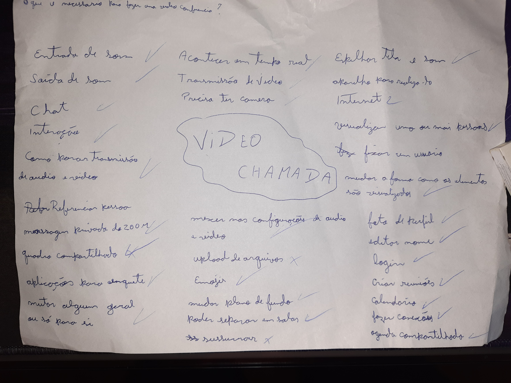

# Brainstorming

| Versão | Data  |                Modificação                |             Autor             |
| :----: | :---: | :---------------------------------------: | :---------------------------: |
|  1.0   | 05/07 |         Criação do Brainstorming          | Gabriel Sabanai, Samuel Avila |
|  1.2   | 07/07 | Elicitação do Brainstorming em um Backlog |        Gabriel Sabanai        |
|  1.3   | 12/07 |       Documentação do Brainstorming       |        Gabriel Sabanai        |

_Tabela de versionamento_

## Introdução

O Brainstorming é uma técnica utilizada pelo grupo de um projeto que visa deixar fluir ideias e pensamentos sem julgamento entre os membros da equipe, também é ideal sempre ter um mediador que vai prescrevendo todas as ideias relatadas entre a equipe. Tem como objetivo criar novas formas de enxergar um problema e explorar a criatividade dos membros. Logo, o Brainstorming agrega o conhecimento e estimula o pensamento ativo na gestão de problemas (SERRANO, 2022).

Nesse caso, o grupo se baseou em uma pergunta principal, sendo ela: "O que é necessário para realizar uma video conferencia?" e com isso foram jogadas diversas ideias que eram anotadas em uma folha de papel.

## Brainstorm

| Local          | Data  | Hora  |
| -------------- | ----- | ----- |
| Casa do Samuel | 05/07 | 16:42 |

_Tabela de informações_

| Membros Participantes |
| --------------------- |
| Gabriel Sabanai       |
| Samuel Avila          |

_Tabela de membros participantes_

### O que é necessário para realizar uma video conferencia?

{width="900"}
_Imagem: brainstorming realizado_

## Requisitos Elicitados

**Legendas**:

-  BS - Brainstorming
-  RF: Requisitos Funcionais
-  RN: Requisitos Não Funcionais

|  ID  |                                                                                  Descrição                                                                                  |   Tipo    | Priorização |
| :--: | :-------------------------------------------------------------------------------------------------------------------------------------------------------------------------: | :-------: | :---------: |
| BS01 |                                  A video chamada deve acontecer em tempo real para que o usuário tenha resposta instantânea de suas ações                                   |    RN     |    MUST     |
| BS02 |                                        A aplicação deve aceitar entrada e saida de som para que o usuário consiga transmitir sua voz                                        |    RN     |    MUST     |
| BS03 |                                        A aplicação deve permitir um chat para que o usuário consiga se comunicar por meio de escrita                                        |    RF     |   SHOULD    |
| BS04 |                              A aplicação deve permitir interações, como levantar a mão, para que o usuário possa se comunicar de forma rápida                               |    RF     |   SHOULD    |
| BS05 |                              A aplicação deve permitir que o usuário consiga se mutar para que seu audio não seja transmitido caso não queira                               |    RF     |    MUST     |
| BS06 |                                   A aplicação deve transmitir o audio de um usuário para outro para que seja possível a comunicação oral                                    |    RN     |    MUST     |
| BS07 |                                           A aplicação deve permitir conexão com a camera do usuário para que ele possa utiliza-la                                           |    RN     |    MUST     |
| BS08 |                                        A aplicação deve transmitir a imagem da camera entre os usuários para que eles possam se ver                                         |    RF     |    MUST     |
| BS9  |                       A aplicação deve permitir que o usuário possa parar a transmissão de seu video para que o mesmo não seja visto caso não queira                        | FUNCIONAL |    MUST     |
| BS10 |                     A aplicação deve permitir referenciar pessoas no chat da transmissão para que o usuário consiga destacar um usuário em sua mensagem                     |    RF     |   SHOULD    |
| BS11 |                    A aplicação deve permitir a mensagem privada entre usuários para que os mesmos possam conversar em particular durante uma conferencia                    |    RF     |    COULD    |
| BS12 |                            A aplicação deve permitir a criações de enquetes para que os usuários possam realizar votações ou tomadas de decisões                            |    RF     |    COULD    |
| BS13 |               A aplicação deve permitir que um usuário consiga mutar outro apenas para sí para que não tenha que escutar alguém sem interferir para os outros               |    RF     |   WOULDNT   |
| BS14 |               A aplicação deve permitir que o administrador da reunião possa mutar um usuário para todos os integrantes para que ninguém tenha que escuta-lo                |    RF     |   SHOULD    |
| BS15 |  A aplicação deve permitir que o usuário ajuste as configurações de audio e video dele para que possa controlar a sensibilidade do audio ou o dispositivo que está usando   |    RF     |    MUST     |
| BS16 |                A aplicação deve permitir que um usuário possa compartilhar um quadro de tarefas para que todos os usuários possam visualizar e mexer com ele                |    RF     |   WOULDNT   |
| BS17 |                           A aplicação deve permitir que o usuário possa utilizar emojis para que consiga se comunicar de forma rápida e divertida                           |    RF     |    COULD    |
| BS18 |                    A aplicação deve permitir que o usuário possa mudar o plano de fundo de seu video para que possa ocultar o redor de onde se encontra                     |    RF     |   SHOULD    |
| BS19 |         A aplicação deve permitir separar usuários em salas numa mesma video chamada para que os usuários possa realizar atividades com outros usuários especificos         |    RF     |    MUST     |
| BS20 |           A aplicação deve permitir que um usuário possa espelhar sua tela e o seu som para que outros usuários possam acompanhar o que o primeiro esteja fazendo           |    RF     |    MUST     |
| BS21 |                                    A aplicação deve funcionar apenas com internet para que os usuários tenha um meio de conexão entre sí                                    |    RN     |    MUST     |
| BS22 | A aplicação deve permitir que o usuário escolha se quer visualizar uma ou mais pessoas para que ele possa controlar a quantidade de pessoas que quer visualizar em sua tela |    RF     |   SHOULD    |
| BS23 |                A aplicação deve permitir que o usuário possa fixar um usuário em sua tela para que tenha um foco naquele usuário e que apenas o visualize-o                 |    RF     |   SHOULD    |
| BS24 |                         A aplicação deve permitir que o usuário possa colocar sua foto de perfil para que outros consigam identifica-lo facilmente                          |    RF     |   SHOULD    |
| BS25 |                         A aplicação deve permitir que o usuário possa editar seu nome de usuário para que outros consigam identifica-lo facilmente                          |    RF     |    MUST     |
| BS26 |                               A aplicação deve permitir que o usuário realize o login para que o mesmo possa acessar suas informações salvas                                |    RF     |   WOULDT    |
| BS27 |                          A aplicação deve permitir que o usuário crie reuniões para que possa realizar as videos conferencias com outros usuários                           |    RF     |    MUST     |
| BS28 |                             A aplicação deve poder criar um calendario para que o usuário possa acompanhar as reuniões que terá durante os dias                             |    RF     |    COULD    |
| BS29 |               A aplicação deve permitir que o usuário faça conexões com outros usuários para que possa ter salvo aqueles que deseja fazer conexões facilmente               |    RF     |   WOULDNT   |
| BS30 |                     A aplicação deve permitir que um usuário possa compartilhar seu calendario com outro para que possam ter um calendario em conjunto                      |    RF     |   WOULDNT   |
| BS31 |                               A aplicação deve poder que um usuário edite o volume de outro usuário para que possa controlar o volume que sai                               |    RF     |   WOULDNT   |
| BS32 |                       A aplicação deve mostrar o historico das videos chamadas que o usuário teve para que o mesmo possa ter um controle de quais foi                       |    RF     |   WOULDNT   |
| BS33 |                          A aplicação deve permitir que o usuário grave a video chamada que está para que tenha acesso a o que ocorreu nela depois                           |    RF     |   SHOULD    |
| BS34 |      A aplicação deve ter um modo de baixa latencia para que o usuário consiga utilizar a plataforma de forma decente quando sua internet estiver com baixa velocidade      |    RF     |   SHOULD    |
| BS35 |           A aplicação deve ter um modo de transcrição automatica para que usuários com deficiencia auditiva consiga ler o que está sendo falado durante a reunião           |    RF     |   WOULDNT   |
| BS36 |                       A aplicação deve ter um modo de narração para que um usuário com deficiencia visual consiga ouvir o que está ocorrendo na tela                        |    RF     |   WOULDNT   |
| BS37 |                                A aplicação deve dar enfase no usuário que está falando para que todos tenham um feedback visual em sua tela                                 |    RF     |    MUST     |
| BS38 |                                    A aplicação deve permitir que o usuário saia da video chamada para que possa encerra-la quando quiser                                    |    RF     |    MUST     |
| BS39 |                     A aplicação deve permitir que o usuário possa recusar um pedido de conexão para que possa negar aqueles que não deseja ter conexão                      |    RF     |   WOULDNT   |
| BS40 |                     A aplicação deve permitir que o usuário possa recusar uma reunião marcada para que possa negar caso não queira participar da mesma                      |    RF     |    MUST     |
| BS41 |                   A aplicação deve permitir que o usuário possa visualizar uma lista e a quantidade de participantes que estão presente na video chamada                    |    RF     |    MUST     |
| BS42 |                            A aplicação deve permitir que o usuário dê um titulo para a reunião para que possa identifica-la para outros usuarios                            |    RF     |    MUST     |

_Tabela: Requisitos elicitados_

## Referências

SERRANO, Maurício; SERRANO, Milene. Requisitos - Aula 07. 1º/2022. 50 slides. Material apresentado para a disciplina de Requisitos de Software no curso de Engenharia de Software da UnB, FGA.

Tutorial: Como fazer Brainstorming Passo a Passo. Disponível em: https://www.siteware.com.br/metodologias/como-fazer-brainstorming-passo-a-passo/ Acesso em: 05 de Julho de 2022.

DUOLINGO. Disponível em: (https://requisitos-de-software.github.io/2019.2-Duolingo/elicitacao/Brainstorming/)[https://requisitos-de-software.github.io/2019.2-Duolingo/elicitacao/Brainstorming/]. Acessado em: 07 de julho de 2022.
