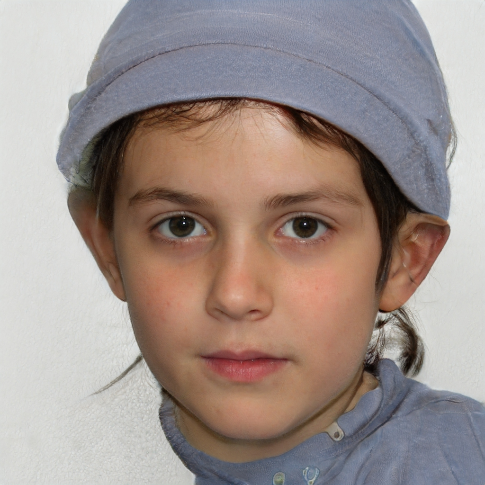
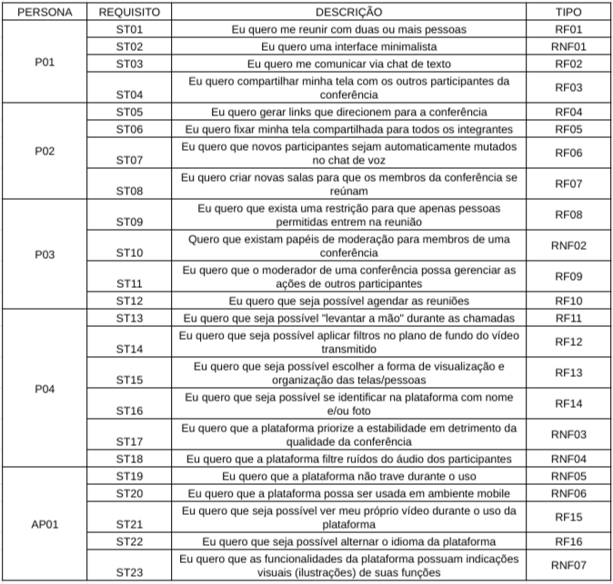
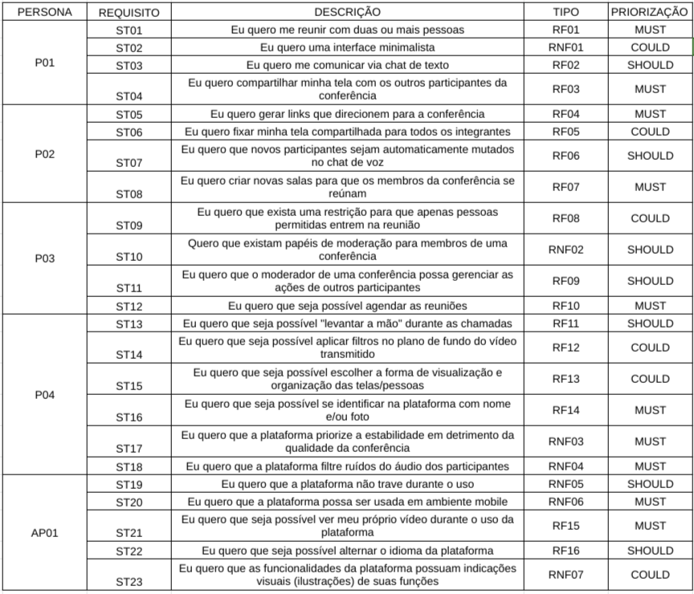

# Personas e Storytelling

| Versão | Data  |   Modificação   |             Autor              |
| ------ | ----- | :-------------: | :----------------------------: |
| 1.0    | 13/07/2022 | Criação das Personas |  Gabriel Mariano, Felipe Cândido, Laís Ramos |
| 1.1    | 13/07/2022 | Introduções das técnicas utilizadas |  Laís Ramos |

## Introdução
    
Mendes e Pietrobon (2013, pág.81) versam que  técnica de Storytelling se resume no ato de contar histórias. Essa técnica milenar tem o seu cerne na narrativa, que é um mecanismo de transmissão de conhecimento. Tal prática tem ganhado novos objetivos, sendo aplicado também na Engenharia de Requisitos, auxiliando o processo de levantamento de requisitos.(Winbladh, Ziv e Richardson 2010). No desenvolvimento do projeto em questão utilizou-se o storyteling de forma a forçar a construção de possíveis situações a serem vividas pelo usuário através de pequenas histórias.

# Personas

## Introdução a Personas
Personas são, em resumo, _modelos_ que buscam representar o modo como os usuários do produto em questão se comportam ao entrar em contato com o mesmo (Cooper et al., 2007). Ainda segundo Cooper, Reimann e Cronin (2007, pág. 75), "personas nos provém com um modo preciso de pensar e comunicar como usuários se comportam, como eles pensam, o que eles querem realizar e por que".

## Perfil do usuário
Por ser uma coleção de projetos de código aberto que fornecem recursos de videoconferência de última geração que são seguros, fáceis de usar e fáceis de auto-hospedar,o Jitsi-Meet possui como principal público alvo  jovens e adultos que possuem por objetivo principal a marcação e realização facilitada de reuniões com caráter mais formal. Vale destacar que o no público-alvo também se equadram pessoas bastante orientada a privacidade, visto que não é necessário que o usuário faça login para participar da reunião. Tal perfil foi baseado tanto no (guia do usuário do Jitse Meet)[https://jitsi.github.io/handbook/docs/intro], quanto nos (fóruns oficiais)[https://community.jitsi.org/] disponíveis.
---

### **Persona 1: Estudante de Graduação**

{width="500"}

*Persona 1: Estudante de Graduação* 

**Nome Fictício:** Matheus García

**Papel:** Estudante de Graduação em Engenharia

**Dados Demográficos:**
- Homem;
- 22 anos;
- Conhecimento básico em programação;
- Conhecimento intermediário sobre a estrutura e funcionamento dos computadores;
- Graduando curso do ensino superior em curso de exatas.

**Metas e Objetivos:** Matheus é um estudante de graduação de engenharia e deseja utilizar o Jitsi Meet como plataforma de comunicação com seu grupo de cálculo 3. 

**Ambiente:** Matheus utilizará o software por meio de um notebook comum conectado à internet via uma conexão de rede.
**Competências:** Matheus é um usuário assíduo de diversas tecnologias desde sua infância, sendo praticamente um nativo digital. Matheus está habituado com o uso de diversos softwares e já utilizou diversos outros serviços de videoconferências.

---

### **Persona 2: Professora Universitária**

{width="500"}

*Persona 2: Professora Universitária* 

**Nome Fictício:** Roberta Matarazzo

**Papel:** Professora de Ciências Biológicas na Universidade de Brasília

**Dados Demográficos:**
- Mulher;
- 45 anos;
- Possui graduação na área de ciências biológicas;
- Possui mestrado na área de ciências biológicas;
- Docente da disciplina de Genética durante período de ensino remoto.

**Metas e Objetivos:** Roberta é professora na Universidade de Brasília lecionando a disciplina de genética. Ela planeja utilizar o Jitsi Meet como plataforma para ministrar suas aulas no período de pandemia.

**Ambiente:** Roberta ministra suas aulas diretamente de sua casa, em seu escritório. Roberta não é tão habituada no uso de computadores, mas tem se esforçado a aprender, principalmente pelas exigências que a pandemia trouxe consigo. Ela utilizará o software a partir de um computador desktop comum, com configurações medianas de hardware.

**Competências:** Roberta, apesar de possuir vasto conhecimento na área de ciências biológicas, não é totalmente adaptada ao meio digital, possuindo certa dificuldade com o uso de alguns softwares e a conexão de periféricos ao desktop. Roberta sabe superficialmente como utilizar um software de videoconferências, mas não consegue ir além em configurações extras que a plataforma possa disponibilizar.

---

### **Persona 3: Empresária do Setor Bancário**

{width="500"}

*Persona 3: Empresária do Setor Bancário* 

**Nome Fictício:** Marcela Hardt

**Papel:** Executiva de Empresa do Setor Bancário

**Dados Demográficos:**
- 28 anos;
- Mulher;
- Ensino Superior na área de Ciências Econômicas;
- Possui escritório individual na empresa.

**Metas e Objetivos:** Marcela busca se comunicar com outros executivos e gerentes através de uma plataforma de comunicação segura e confiável. Marcela participa tanto de reuniões de curta duração quanto de reuniões de planejamento, que podem vir a durar horas. Marcela busca deixar reuniões agendadas para que possa organizar melhor seu tempo.

**Ambiente:** Marcela participa de suas reuniões em seu escritório, utilizando de seu computador empresarial conectado à rede através de conexão cabeada e estável. O escritório de Marcela é individual e sem maiores elementos que a possam perturbar durante suas reuniões.

**Competências:** Marcela possui vasto conhecimento de plataformas de gestão empresarial e de finanças, no geral. Marcela utiliza computadores e celulares desde sua adolescência, possuindo então certa experiência com tais meios.

---

### **Persona 4: Estudante do Ensino Médio**

{width="500"}

*Persona 4: Estudante do Ensino Médio* 

**Nome Fictício:** Fernanda Maia

**Papel:** Estudante do Ensino Médio

**Dados Demográficos:**
- 15 anos;
- Mulher;
- Estudante do ensino médio durante período remoto;
- Possui conhecimento básico de tecnologias.

**Metas e Objetivos:** Fernanda busca acompanhar suas aulas durante o período de ensino remoto através de uma plataforma proposta por seus docentes. Fernanda busca participar ativamente de suas aulas via vídeo, chat de voz ou chat de texto. Fernanda espera que a plataforma seja estável.

**Ambiente:** Fernanda acompanhará suas aulas em sua mesa de estudos disposta em seu quarto, através de seu tablet conectado à internet via Wi-Fi.

**Competências:** Fernanda possui contato com tecnologias e com o meio digital desde sua infância, sendo adaptada às ferramentas tradicionais utilizadas no ambiente escolar, mas sem apresentar um domínio aprofundado sobre elas, apesar de possuir a habilidade de aprendizado rápido.

---

### **Antipersona: Criança sem Experiência**

{width="500"}

*Antipersona: Criança sem Experiência* 

**Nome Fictício:** Valentina Meire

**Papel:** Criança sem experiência com plataformas de vídeo chamadas

**Dados Demográficos:** 
- 8 anos;
- Menina;
- Estudante do ensino fundamental;
- Mora com os pais.

**Metas e Objetivos:** Valentina, sob a tutela de seus pais, busca se comunicar com seus familiares fisicamente distantes. Valentina espera conversar com estes via chat de voz e vê-los através de vídeo. Por não entender muito sobre o funcionamento das plataformas de vídeo chamadas, Valentina espera que a comunicação seja fluida e sem quedas/falhas.

**Ambiente:** Valentina está na sala de casa, acompanhada de seus pais, participando da vídeo chamada através de um notebook localizado na mesa de centro da sala. O aparelho está conectado na internet através de rede Wi-Fi, que pode apresentar instabilidades.

**Competências:** Valentina é uma nativa digital, isto é, foi exposta à tecnologia desde sua infância passada. Apesar disso, está habituada apenas com jogos casuais via smartphone. Valentina não possui experiência com plataformas de videoconferência, apesar de já ter sido exposta a chamadas de vídeo realizadas por seus pais.

---

# Elicitação dos Requisitos

## **Storytelling Utilizando Personas**

O método de elicitação por meio de Storytelling utilizando Personas consiste em criar uma história envolvendo cada uma das personas e dessa história abstrair os requisitos necessários para o software. No nosso caso, duas pessoas interpretavam e narravam as histórias, enquanto outra anotava e conduzia a elicitação em si.

### _**Matheus García**_

As aulas da UnB acabaram de voltar e, no primeiro dia, a professora de cálculo 3 mandou os alunos se reunírem em grupos de até 5 pessoas. Após a formação dos grupos, Matheus e seus colegas estavam discutindo como seria feita a comunicação entre eles, visto que nem sempre todos eles estariam disponíveis depois ou antes da aula para uma possível reunião. Assim, Matheus recomendou que usassem a plataforma de videoconferências Jitsi Meet, a qual um amigo havia o apresentado na disciplina de cálculo 2, para que pudessem se reunir à distância.

### _**Roberta Matarazzo**_

Com a vinda da pandemia, a professora Roberta se viu diante de um enorme problema. Como faria para dar suas aulas agora, já que todos estavam de quarentena? Após muita pesquisa e pedidos de recomendações à seus colegas de trabalho, Roberta encontrou a plataforma Jitsi Meet. Dessa forma, após testar um pouco para entender como funcionava, comunicou os seus alunos de que todas as aulas seriam ministradas por lá.

### _**Marcela Hardt**_

Com o surgimento do novo coronavírus e a vinda da pandemia, Marcela e seus colegas de trabalho encontraram um problema, visto que não poderiam realizar suas reuniões por conta do trabalho remoto. Como solução, Marcela encontrou a plataforma de vídeoconferência Jitsi Meet, permitindo que pudessem realizar tanto reuniões curtas, quanto longas, sem a necessidade de estarem no mesmo ambiente.

### _**Fernanda Maia**_

Fernanda é uma estudante do ensino médio, e logo em seu primeiro ano nessa nova fase de aprendizado, veio a pandemia. Após muitas dúvidas de como ia fazer para estudar remotamente, visto que mesmo cedo já estava preocupada com o ENEM, seus professores acabaram por achar uma solução. A plataforma de videoconferência  Jitsi Meet seria usada para a condução das aulas remotas, para que nenhum prejuízo ao aprendizado ocorresse. Assim, por meio de seu tablet Fernanda foi capaz de acompanhar todas as aulas e começar a se preparar para o tão esperado vetibular. 

### _**Valentina Meire**_

Valentina, por conta da pandemia e da quarentena, estava morrendo de saudades de seus avós já que, pela segurança deles, não estava podendo visitá-los. Assim, os pais da Valentina tiveram uma ideia para aplacar um pouco esse sentimento. Eles utilizariam a plataforma Jitsi Meet, recomendada por uma antigo amigo da família, para realizar uma videoconferência com os parentes distantes. Então, com a assessoria de seus pais, a menina foi capaz de conversar e visualizar seus avós, reduzindo um pouco a distância que esses novos tempos trouxeram.

## Gravação

## Requisitos Elicitados

Abaixo estão os requisitos elicitados com a técnica do Storytelling utilizando as Personas supracitadas. Note que as personas, na tabela, estão identificadas através da sigla _"P0X"_ (onde o _X_ representa o número da persona), além disso, a antipersona está identificada pela sigla _"AP01"_.

Os requisitos estão identificados sequencialmente pela sigla _"STXX"_ (onde o _XX_ indica a numeração do requisito). Além disso, há a separação dos requisitos em **Funcionais** _(RFXX)_  e em **Não Funcionais** _(RNFXX)_.

{width="900"}
*Elicitação realizada com a técnica Storytelling* 

---

## Gravação

## Priorização dos Requisitos Elicitados

Abaixo estão os requisitos elicitados com a técnica do Storytelling e priorizados com a técnica _MoSCoW_. A priorização está dividida entre os três termos adotados na técnica: **Must**, **Should** e **Could**.

{width="900"}
*Priorização realizada com a técnica MoSCoW* 

---

## Referências

**Cooper, A.; Reimann, R.; Cronin, D.** 2007. "About Face 3: the essentials of interaction design", página 75. Indianapolis: Wiley Publishing, Inc. _Traduzido_.

[**MENDES, Tamara M.; PIETROBON, Carlos A. M.**](https://sol.sbc.org.br/index.php/sbqs/article/view/15275/15118) Uso de Storytelling para Apoiar a Gestão de Conhecimento no Desenvolvimento de Software. In: SIMPÓSIO BRASILEIRO DE QUALIDADE DE SOFTWARE (SBQS), 12. , 2013, Salvador. Anais [...]. Porto Alegre: Sociedade Brasileira de Computação, 2013 . p. 81-94.

**U.S. General Services Administration**. “usability.gov: Improving the User Experience”. Disponível em: <https://www.usability.gov/how-to-and-tools/methods/personas.html>. Acesso em 11 jul. 2022.

**Técnica MoSCoW**. Disponível em: <https://unbarqdsw.github.io/2020.1_G1_Triagil/modelagem/extra/priorizacao/moscow/>

DISNEY PLUS. Disponível em: (https://requisitos-de-software.github.io/2021.1-DisneyPlus/elicitacao/personas/)[https://requisitos-de-software.github.io/2021.1-DisneyPlus/elicitacao/personas/]. Acessado em: 13 de julho de 2022.

**Comunidade Jitse Meet**. Disponível em: (https://community.jitsi.org/)[https://community.jitsi.org/]. Acessado em 10 de Setembro de 2022

**Guia do usuário Jitsi Meet**. Disponível em: (https://jitsi.github.io/handbook/)[https://jitsi.github.io/handbook/]. Acessado em 10 de Setembro de 2022.

## Fonte das Imagens

**Karras et al. and Nvidia**. “thispersondoesnotexist”. Disponível em: <https://thispersondoesnotexist.com/>. Acesso em 11 jul. 2022.
