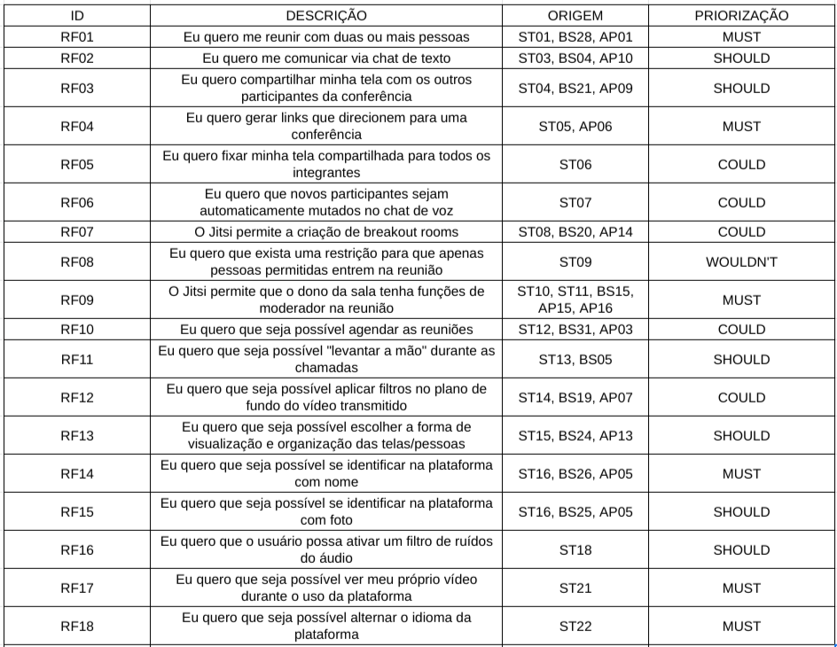
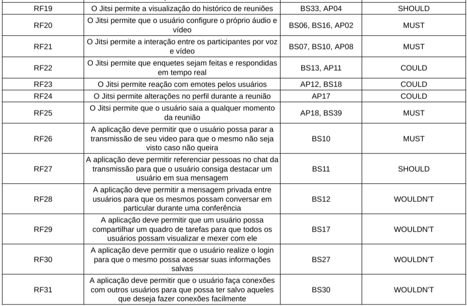
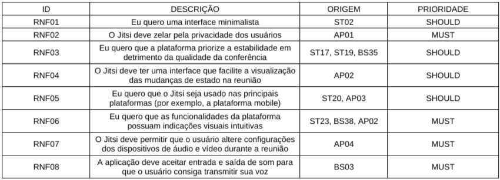

# Requisitos Elicitados

| Versão | Data  |   Modificação   |             Autor              |
| ------ | ----- | :-------------: | :----------------------------: |
| 1.0    | 13/07/2022 | Elicitação dos requisitos |  Grupo |

_Tabela de Versionamento_

## Introdução

Com o objetivo de facilitar futuras consultas, os requisitos elicitados serão compilados nessa página.

## Metodologia

A partir dos metodos utilizados, vários requisitos funcionais e não funcionais foram elicitados. A partir disso, todos foram compilados com sua prioridade e metodo de origem.

# MoSCoW

## Introdução
Tendo base no repositório da aplicação Triagil,é possível se constatar que o MoSCoW é um método de priorização utilizado para especificar os requisitos de acordo com a sua criticidade e seu valor de negócio. Facilita a priorização do escopo de forma a dividir quais tarefas são de suma importância para o sucesso do projeto e quais poderiam ser descartadas caso o mesmo sofra algum tipo de mudança de prazo e/ou perda de recursos. MoSCoW é um aconimo para as 4 categorias de requisitos utilizados na predileção: **M** de *must have*, **S** de *should have*, **C** de *could have* e **W** de *wont't have ou would like*, como comumente é usado. Portanto, a criticidade e relevância dos requisitos são classificados por:
* **Must** : Requisitos de extremo interesse para o projeto; sem essas funcionalidades, o produto perde sentido e valor. **Têm** de ser implementados.
* **Should**: Possuem importância equivalente ao Must, entretanto o seu nível de criticidade para o projeto é menor, ou seja, se não forem desenvolvidos não haverá perda do valor de negócio. **Devem** ser desenvolvidos.

* **Could**: São requisitos ligados À desejos do cliente, que **poderiam**, mas não precisam se desenvolvidos. Geralmente estão relacionados à aperfeiçoamento da experiência do usuário.
* **Won't/Would Like**: Requisitos inseridos nessa categoria não são necessários para o projeto além de não gerarem tanto valor de negócio. Serão desenvolvidos **talvez** em próximas versões a apenas depois de todos os requisitos das categorias acima serem desenvolvidos.
Para a priorização dos requisitos do projeto Jitsi Meet foram  utilizados apenas as classificações Must, Could e Would para facilitar o processo de primazia dos requisitos.

## Legenda

| Código | Significado |
| :----: | :---------- |
| RF| Requisitos Funcionais |
| RNF | Requisitos Não Funcionais |
| ST | Personas e Storytelling |
| BS | Brainstorming | 
| AP | Análise de Protocolo |

_Tabela de Legenda_

Os requisitos elicitados da análise de protocolo possuí tabelas separadas de Funcionais e Não funcionais. Para melhor entendimento ao agruparmos, levamos em consideração os seguimentos de cada tabela para enumeração com seus respectivos tipos de requisitos.

## Requisitos Funcionais

_Imagem 1: Requisitos Funcionais_

## Requisitos Não Funcionais

_Imagem 2: Requisitos Não Funcionais_

## Considerações finais 

| Tipo | Quantidade |
| :----: | :---------- |
| Requisitos Funcionais | 31 |
| Requisitos Não Funcionais | 08 |

_Tabela de requisitos_

| MoSCoW | Quantidade |
| :----: | :---------- |
| MUST | 14 |
| SHOULD | 12 |
| COULD | 8 |
| WOULDNT | 5 |

_Tabela de Priorizações_

## Referências

SERRANO, Maurício; SERRANO, Milene. Requisitos - Aula 07. 1º/2022. 50 slides. Material apresentado para a disciplina de Requisitos de Software no curso de Engenharia de Software da UnB, FGA.

**Técnica MoSCoW**. Disponível em: <https://unbarqdsw.github.io/2020.1_G1_Triagil/modelagem/extra/priorizacao/moscow/>
