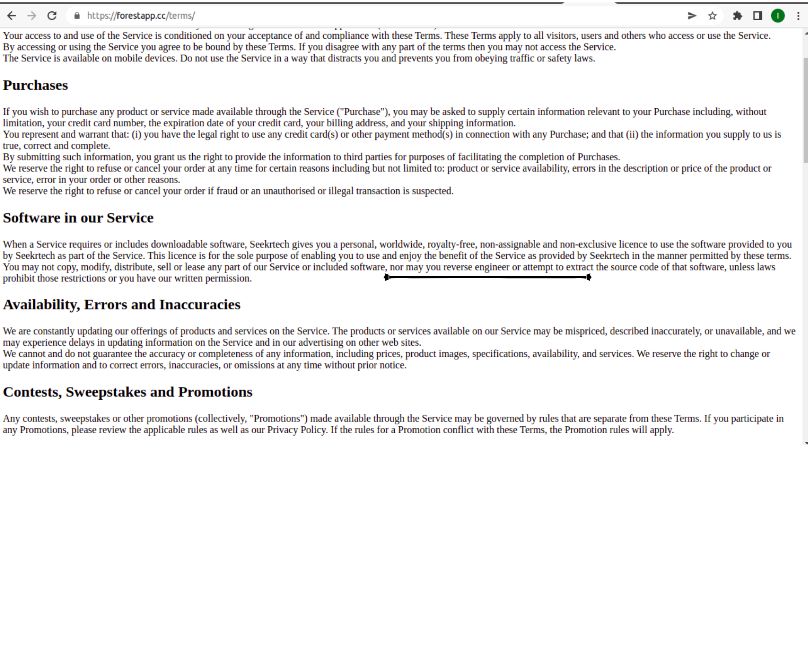
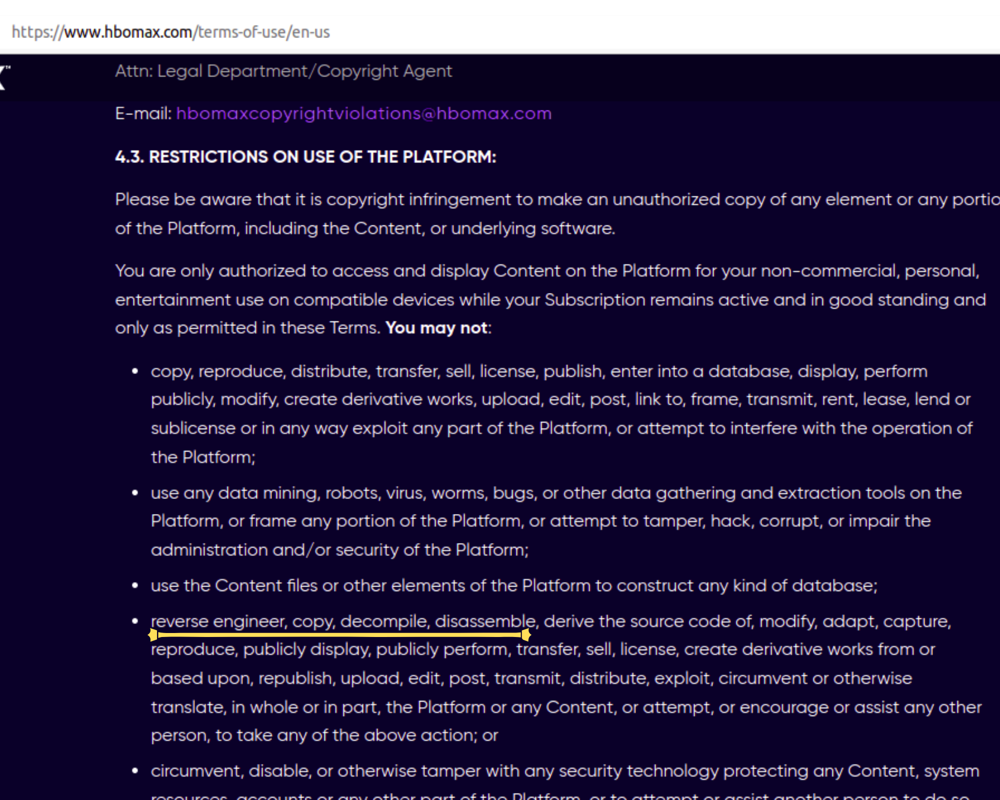

# Início

## Versionamento do projeto

| Versão | Data  |   Modificação   |             Autor              |
| ------ | ----- | :-------------: | :----------------------------: |
| 1.0    | 28/06 | Criação da wiki | Gabriel Sabanai e Samuel Avila |
 1.0    | 10/07 | Inserção dos outros aplicativos analisados e revisão| Laís Ramos |

_Tabela 1: Versionamento_

 

*Imagem 1: Jitsi Logo*

## Introdução

Repositório da disciplina de Requisitos de Software 2022.1 realizado sobre a aplicação Jitsi. Este repositório reúne artefatos de requisitos de software levantados a partir da aplicação web, mobile e desktop do Jitsi.

## Por que o Jitsi?

O Jitsi é um software open-source, disponibilizados para diversas plataformas, desenvolvido visando facilitar a construção de videos conferencias entre usuários, o que,além das videos conferencias, permite funcionalidades especificas para audio, gravações e transmissões simultaneas. O serviço base do aplicativo é a conexão entre os usuários por meio de videos conferencias, sendo utilizado como objetivo de estudo visando a aplicação do conteúdo ministrado na disciplina de Requisitos de Software. A escolha do aplicativo, dentre outros fatores, foi devido ao seu enfoque na melhoria de facilitação de comunicação, organização e eficiência dos usuários.

## Jitsi em outros repositórios

Até o dia de hoje, 29 de Junho de 2022, não existem repositórios públicos que visam documentar o aplicativo Jitsi. Por enquanto, todos os respositórios existentes relacionados a aplicação são implementações de funcionalidades no software, ou criação de clones da plataforma pelo front-end ou, então, o próprio repositorio existente, já que, é uma aplicação open-source.

Dessa forma, não existe nenhum repositório, que visa documentar o sistema, no qual a nossa equipe conseguiria se basear ou retirar informações que possam prejudicar a aplicação do aprendizado da disciplina.

## Outros aplicativos analisados
Inicialmente o grupo havia optado por analisar os aplicativos Forest, aplicação de controle e gestão de tempo, e o aplicativo HBO Max, aplicativo de streaming da rede de canais HBO. Entretanto, após pesquisa nas políticas de utilização das aplicações, foi possível constatar que ambos não permitem a aplicação de Engenharia Reversa, impossibilitando assim o desenvolvimento do projeto.

## Equipe

| Foto                                                                     | Nome            | Email                             | GitHub                                             |
| ------------------------------------------------------------------------ | --------------- | --------------------------------- | -------------------------------------------------- |
|  | Gabriel Sabanai | gabrielsabanaitrindade@gmail.com  | [@Sabanai104](https://github.com/Sabanai104)       |
|     | Samuel Avila    | samuel2001.furtadoavila@gmail.com | [@samuelfavila](https://github.com/samuelfavila)   |
|   | Felipe Moura  | mourapipe@gmail.com          | [@felipecdmoura](https://github.com/felipecdmoura) |
|  | Gabriel Mariano | mariano.gabriel2q@gmail.com  | [@gabrielm2q](https://github.com/gabrielm2q)       |
|       | Laís Ramos      | laisramos123@gmail.com       | [@laisramos123](https://github.com/laisramos123)   |
|      | André Alves     | andremralves@gmail.com             | [@andremralves](https://github.com/andremralves)   |
