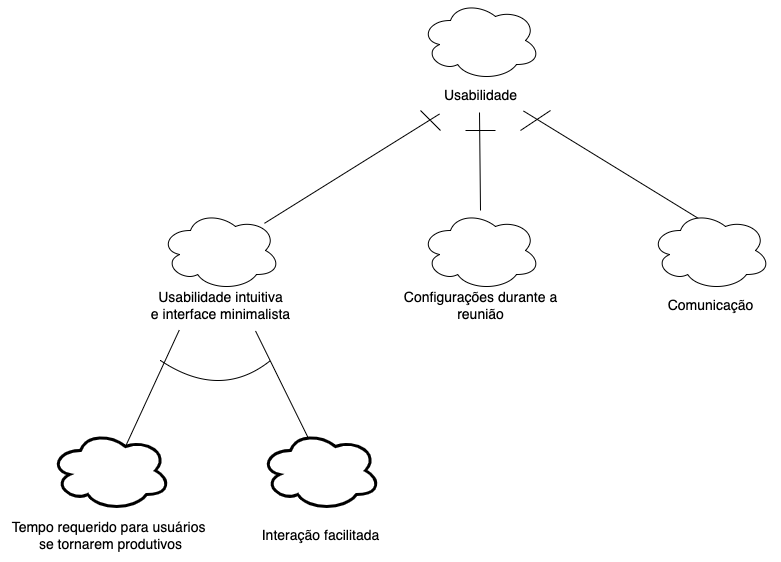
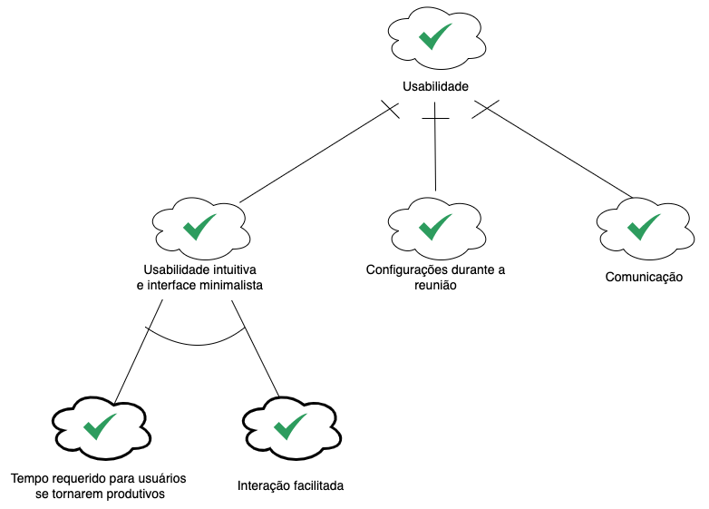
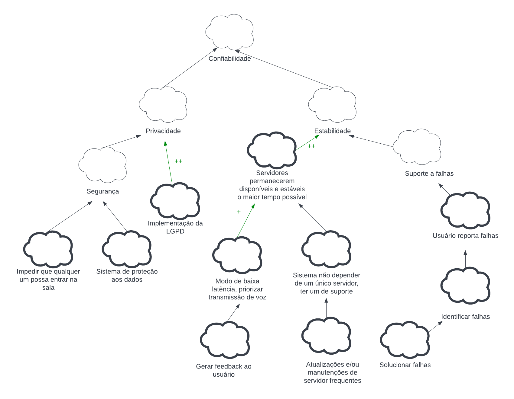
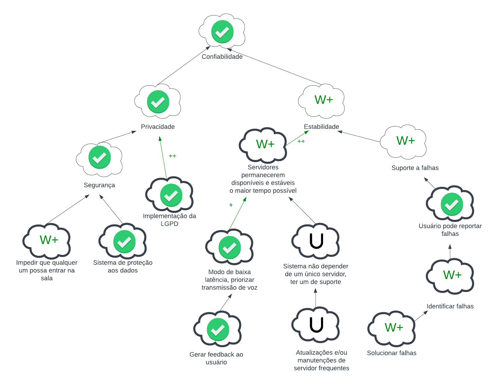
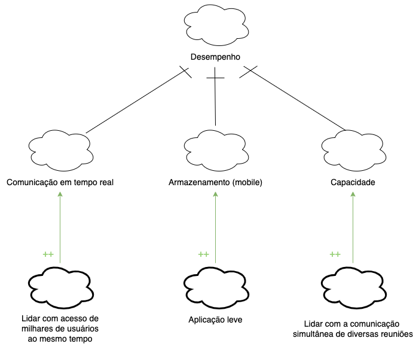
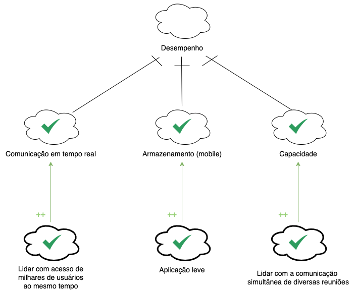
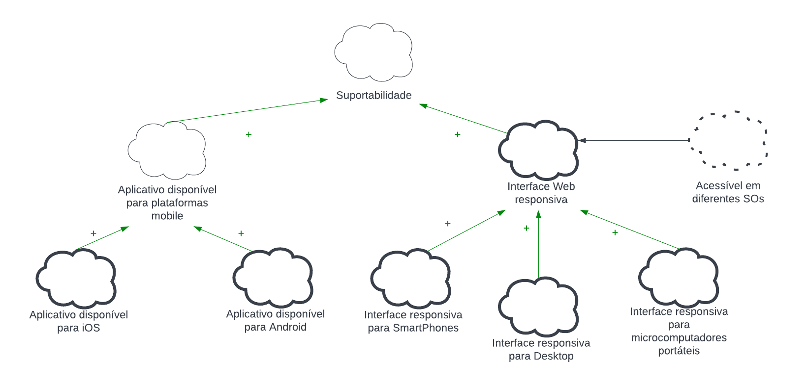

# NFR Framework

## Versionamento

| Versão | Data  |                           Modificação                           |             Autor              |
| ------ | ----- | :-------------------------------------------------------------: | :----------------------------: |
| 1.0    | 01/08 |               Elaboração do NFR          |   Gabriel Sabanai e Samuel Avila    |
| 1.1    | 02/08 |               Criação da Documentação                   |  Gabriel Sabanai e Samuel Avila |
| 1.2    | 03/08 |               Finalização da Documentação                           |  Gabriel Sabanai e Samuel Avila |

_Tabela 1: Versionamento_

## Introdução

O NFR framework é uma abordagem para análisar e representar os requisitos não funcionais. Dessa forma, ele orienta a engenharia de requisitos em volta aos requisitos não funcionais e inclui características de prioridades e carga de trabalho, tudo isso a partir da utilização do modelo SIG (Softgoal Interdepency Graph). (CHUNG et al., 2000) 

## Metodologia

Para elaborar os diagramas -cada um gerenciando um requisito não funcional da Especificação Suplementar- abordamos os NFRs a partir de uma decomposição destes requisitos em um nível operacional, facilitando em seu entendimento, em sua priorização e garantindo que as necessidades do cliente sejam atendidas.

Os tipos de contribuição utilizados nos diagramas foram:

* AND: Caso os softgoals descendentes sejam satisfeitos, serão também os ascendentes.
* OR: Caso algum softgoal descendentes seja satisfeitos, será também os ascendente.
* MAKE (++): Caso o softgoal descendente for suficientemente satisfeito, será também o ascendente, porém, a contribuição é fornecida como suficientemente positiva concebida no nível mais alto de satisfação.
* HELP (+): Caso o softgoal descendente seja parcialmente satisfeito, será parcialmente satisfeito o ascendente.
* HURT (-): Caso o softgoal descendente seja satisfeito, o softgoal ascendente será parcialmente negado.

Rótulos:

| Rótulo | Descrição |
| :----: | :-------: |
|  | Satisfeito |
|  | Negado |

Os diagramas foram montados pelos membros Gabriel Sabanai e Samuel Avila sendo e em seguida foi válidado e revisado por demais membros do grupo. Além disso, eles foram feitos utilizando a plataforma Draw.io e lucidchart no dia 01 de agosto de 2022.

## Resultados

## Gráfico de Interdependencia de Softgoal (SIG)

### Usabilidade 

_Imagem 1: NFR Usabilidade_

### Usabilidade Propagação

_Imagem 2: NFR Usabilidade Propragação_

### Confiabilidade

_Imagem 3: NFR confiabilidade_

### Confiabilidade Propagacao

_Imagem 4: NFR confiabilidade propagacao_
### Desempenho

_Imagem 5: NFR Desempenho_

### Desempenho Propagação

_Imagem 6: NFR Desempenho Propragação_

### Suportabilidade

_Imagem 7: NFR Suportabilidade_

### Suportabilidade Propagação

_Imagem 8: NFR Suportabilidade Propagação_