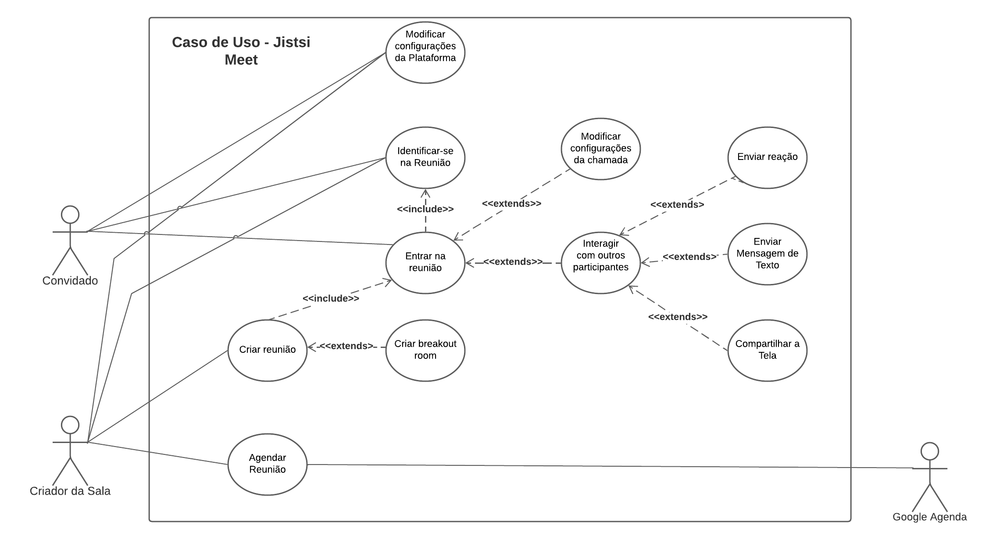
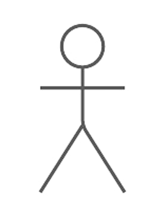
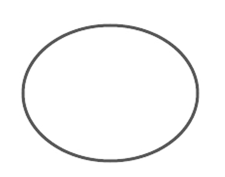
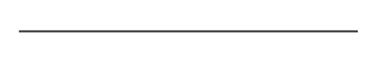
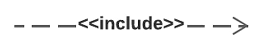
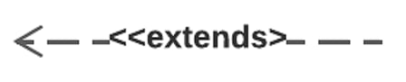
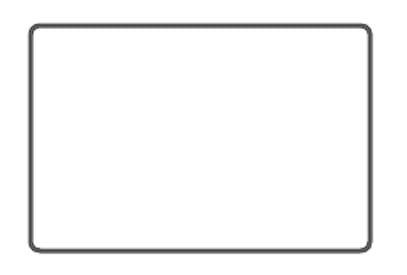

# Use Case

## Versionamento

| Versão | Data  |                           Modificação                           |             Autor              |
| ------ | ----- | :-------------------------------------------------------------: | :----------------------------: |
| 1.0 | 19/07 |               Criação do Use Case                | Felipe Moura e Gabriel Mariano |
| 1.1 | 19/07 |               Revisão da doc               | Gabriel Sabanai |

_Tabela 1: Versionamento_

## Introdução

De acordo com definição do [SEVOCAB](https://pascal.computer.org/sev_display/printSearch.action?term=use+case&source=), um _Use Case_ é uma descrição das ações requisitadas de um sistema. Deste modo, este artefato busca, através da representação com um Diagrama de Caso de Uso, representar os _Use Cases_ do sistema em questão: o Jitsi Meet. Todos os _Use Cases_ criados foram baseados nos [requisitos elicitados](../elicitacao/requisitoselicitados.md) pelo grupo.

## Metodologia

Para a representação dos _Use Cases_ (descrição das ações requisitadas de um sistema, segundo o [SEVOCAB](https://pascal.computer.org/sev_display/printSearch.action?term=use+case&source=)), foi utilizado o Diagrama de Caso de Uso que, segundo definição do [Lucidchart](https://www.lucidchart.com/pages/pt/diagrama-de-caso-de-uso-uml), visa apresentar de forma visual as possibilidades de interação do usuário com o sistema, apresentando também o escopo desse sistema.

Um Diagrama de Caso de Uso é composto basicamente pelos _**Use Cases**_, pelos **Atores**, pelas **Associações** (que podem ser derivados em _includes_ e _extends_) e pela **Fronteira do Sistema**. Sendo que, neste caso em específico, os _Use Cases_ representam ações derivadas do que foi anteriormente requisitado na [Elicitação de Requisitos](../elicitacao/requisitoselicitados.md).

## Use Cases

Abaixo estão listados todos os _Use Cases_ que serão representados no Diagrama de Caso de Uso:

- Criar reunião

- Entrar na reunião

- Agendar reunião

- Modificar configurações da Plataforma

- Identificar-se na Reunião

- Criar _breakout room_

- Modificar configurações da chamada

- Interagir com outros participantes

- Enviar reação

- Enviar Mensagem de Texto

- Compartilhar a Tela

## Diagrama de Caso de Uso

*Imagem 1: Diagrama de Casos de Uso*

## Legenda: Diagrama de Caso de Uso

| Componentes | Comentários |
| ----------- | ----------- |
| <h3><b>Atores</h3></b> { width=100 } | São os usuários do sistema, podendo ser tanto primários (engajam o sistema) quanto secundários (reagem ao sistema). |
| <h3><b>Casos de Usuário</h3></b> { width=100 } | Representam os Casos de Uso que os atores podem realizar. |
| <h3><b>Relacionamento de Associação</h3></b> { width=100 } | Determinam um relacionamento com os atores que estão diretamente associados ao Caso de Uso. |
| <h3><b>Relacionamento de Inclusão</h3></b> { width=100 } | Determinam um relacionamento entre dois Casos de Uso em que um depende de outro. |
| <h3><b>Relacionamento de Extensão</h3></b> { width=100 } | Determinam uma relação entre dois Casos de Uso em que um não necessariamente depende do outro. |
| <h3><b>Limites do Sistema</h3></b> { width=100 } | Identifica o limite do sistema. |

*Tabela 2: Legenda do Diagrama de Caso de Uso*

## Referências

**SEVOCAB**. "Use Case". Disponível em: <https://pascal.computer.org/sev_display/printSearch.action?term=use+case&source=>. Acesso em 19 jul. 2022 às 18:29.

**DevMedia**. "O que é UML e Diagramas de Caso de Uso: Introdução Prática à UML", por Leandro, 2012. Disponível em: <https://www.devmedia.com.br/o-que-e-uml-e-diagramas-de-caso-de-uso-introducao-pratica-a-uml/23408>. Acesso em 19 jul. 2022 às 18:29.

**Lucidchart**. "Diagrama de caso de uso UML: O que é, como fazer e exemplos". Disponível em: <https://www.lucidchart.com/pages/pt/diagrama-de-caso-de-uso-uml>. Acesso em 19 jul. 2022 às 18:31.

**Até o Momento**. "Caso de Uso – Include, Extend e Generalização", por Plínio Ventura, 2021. Disponível em: <https://www.ateomomento.com.br/caso-de-uso-include-extend-e-generalizacao/>. Acesso em 19 jul. 2022 às 18:42.