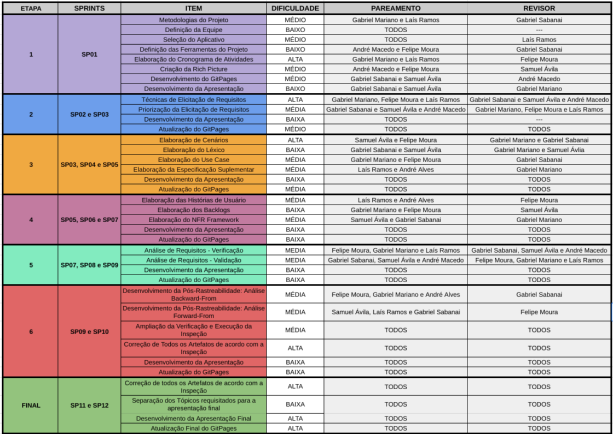

# Cronograma

| Versão | Data  |   Modificação   |             Autor              |
| ------ | ----- | :-------------: | :----------------------------: |
| 1.0    | 30/06/2022 | Criação do cronograma |  Gabriel Mariano, Laís Ramos  |
| 1.1    | 13/07/2022 | Revisäo do cronograma |  Felipe Moura  |
| 1.2    | 03/08/2022 | Revisäo do cronograma |  Gabriel Mariano |
| 1.3    | 17/08/2022 | Revisäo do cronograma |  Gabriel Mariano |
| 1.4    | 12/09/2022 | Revisäo do cronograma |  Gabriel Mariano |

*Tabela 1: versionamento*

## Introdução

Foi analisado o cronograma do semestre letivo, os prazos da disciplina e a disponibilidade dos integrantes. Dessa forma, foi criado um cronograma (Figura 1) que foi dividido em etapas para a realização das atividades e cumprimento dos prazos (Tabela 2), todos baseados no product backlog descrito (Figura 2).

## Cronograma de atividades

*Figura 1: Cronograma de sprints*

## Datas e Sprints

| Sprint | Data de entrega  |   Etapa   |  Tópico | Entregas|
| ------ | ----- | :-------------: | :----------------------------: | :---------:|
| Sprint 1  | 29/06 | 1 |  Planejamento | Planejamento do Projeto, Equipe, App Selecionado, Ferramentas do Projeto, Cronograma das Atividades, Rich Picture. |
| Sprint 2  | 13/07 | 2 |  Elicitação de Requisitos | Técnicas e Priorização |
| Sprint 3  | 13/07 | 2 |  Elicitação de Requisitos | Técnicas e Priorização |
| Sprint 4  | 20/07 | 3 |  Modelagem de Requisitos | Cenários, Léxico, Use Case, Especificação Suplementar |
| Sprint 5  | 20/07 | 3 |  Modelagem de Requisitos | Cenários, Léxico, Use Case, Especificação Suplementar |
| Sprint 6  | 03/08 | 4 |  Modelagem de Requisitos Ágeis | Histórias de Usuário, Backlogs, NFR Framework |
| Sprint 7  | 03/08 | 4 |  Modelagem de Requisitos Ágeis | Histórias de Usuário, Backlogs, NFR Framework |
| Sprint 8  | 17/08 | 5 |  Análise de Requisitos | Verificação e Validação |
| Sprint 9  | 17/08 | 5 |  Análise de Requisitos | Verificação e Validação |
| Sprint 10 | 24/08 | 6 |  Pós-rastreabilidade | Gerência |
| Sprint 11 | 12/09 | 7 |  Projeto Final | Apresentação do Projeto Final |

*Tabela 2: Tabela de datas e sprints*

## Cronograma Detalhado

*Figura 2: Cronograma Detalhado das Sprints*

### **Observação**

Algumas atividades são apresentadas enquanto sendo atribuição de **TODOS** a sua realização e, em alguns casos, sua revisão. Tais atividades são de fato de responsabilidade coletiva e podem ser atribuídas informalmente em diversas partes para diversos membros conforme sua disponibilidade.