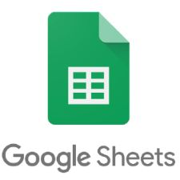
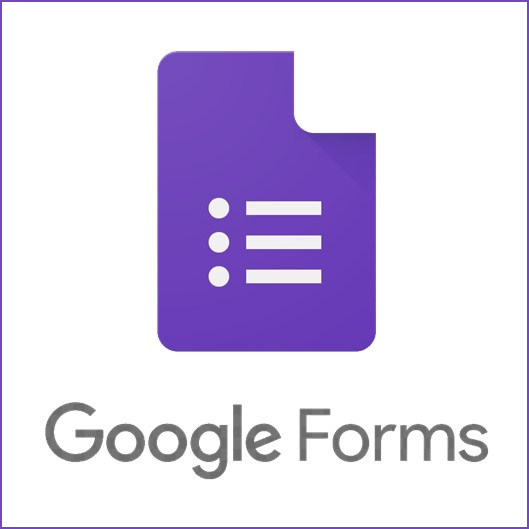
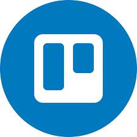

# Ferramentas

## Versionamento

| Versão | Data       |         Modificação          |    Autor     |
| ------ | ---------- | :--------------------------: | :----------: |
| 1.0    | 29/06/2022 | Documentação das ferramentas | Samuel Avila |
| 1.1    | 05/07/2022 | Correção das imagens         | André Alves  |

_Tabela 1: versionamento_

## Introdução

 As ferramentas são os softwares utilizados pela equipe para garantir um bom desenvolvimento do projeto.

_Tabela 2: introdução_

## Ferramentas utilizadas

|                                                   |    Ferramenta     | Finalidade                                  |
| :-----------------------------------------------: | :---------------: | ------------------------------------------- |
|      |      Github       | Versionamento do projeto.|
|      |     Telegram      | Comunicação por texto entre os integrantes. |
|        |      Discord      | Reuniões da equipe.                         |
|     |   Google Drive    | Armazenamento de documentos.                |
|   |   Google Sheets   | Tabelas para organização do projeto         |
|  | Google Documents  | Elaboração de documentos para o projeto.    |
|   |   Google Forms    | Ferramenta para criação de formulários      |
|  |    LucidChart     | Elaboração de diagramas.                    |
|          |      Trello       | Gerenciamento das atividades do projeto.    |
|          | VisualStudio Code | Ferramenta para edição de documentação      |
|            |    Jitsi Meet     | Aplicação tema a ser analisado.             |

_Tabela 3: Tabela contendo as ferramentas utilizadas no projeto_

## Referências

Wiki Requisitos - Planejamento - Ferramentas. Disponível em: https://github.com/Requisitos-de-Software/2021.2-Tembici/blob/main/docs/planejamento/ferramentas.md?plain=1. Acesso em: 29 de junho de 2022.

_Tabela 4: Tabela de referências_
