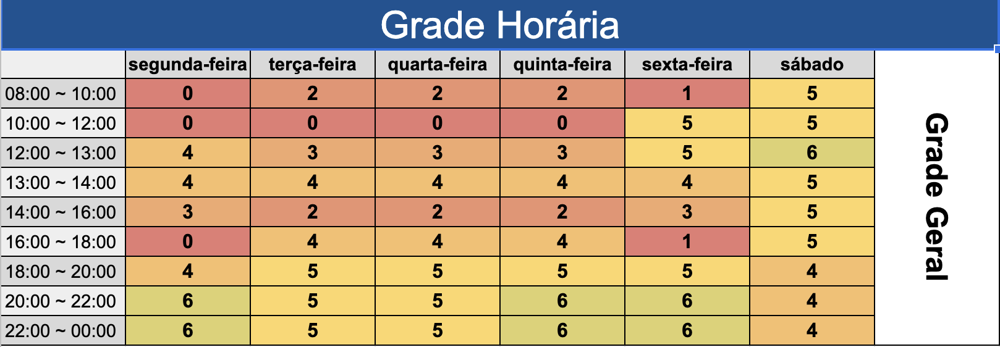

# Heatmap

## Versionamento

| Versão | Data       |   Modificação   |             Autor              |
| ------ | ---------- | :-------------: | :----------------------------: |
| 1.0    | 29/06/2022 | Criação Heatmap | Samuel Avila e Gabriel Sabanai |

_Tabela 1: versionamento_

## Introdução

Para um melhor conhecimento da disponibilidade dos membros da equipe foi feito, por meio de um heatmap, o levantamento da disponibilidade de cada membro. O mapeamento foi realizado em blocos de 1 hora para facilitar o desenvolvimento geral do heatmap.

## Metodologia

O Heatmap foi realizado utilizando o uma planilha no software web Google Planilhas, foi associado um numéro a cada membro da equipe para o preenchimento do readmap:

| Id  |      Nome       |
| :-: | :-------------: |
|  1  | Gabriel Sabanai |
|  2  |   Laís Ramos    |
|  3  |  Felipe Moura   |
|  4  |  Samuel Avila   |
|  5  | Gabriel Mariano |
|  6  |   André Alves   |

_Tabela 1: Id de cada membro_

As cores do readmap estão relacionados a quantidade de membros disponiveis no horário:

Cores

|    Quantidade    |       Cores        |
| :--------------: | :----------------: |
|  Nenhum membro   |      Vermelho      |
|     1 membro     |   Vermelho claro   |
|    2 membros     |      Laranja       |
|    3 membros     |   Laranja claro    |
|    4 membros     |   Amarelo escuro   |
|    5 membros     |      Amarelo       |
| Todos os membros | Amarelo esverdeado |

_Tabela 2: Significado de cada cor_

Todos os integrantes do grupo participaram de forma assíncrona colocando os horários que estavam disponíveis, e o artefato foi criado para que o grupo pusse saber o melhor dia e hora para se reunir semanalmente.

## Resultados

Figura 1: Heatmap de horários_

_Autores: Samuel Avila, Gabriel Sabanai_
